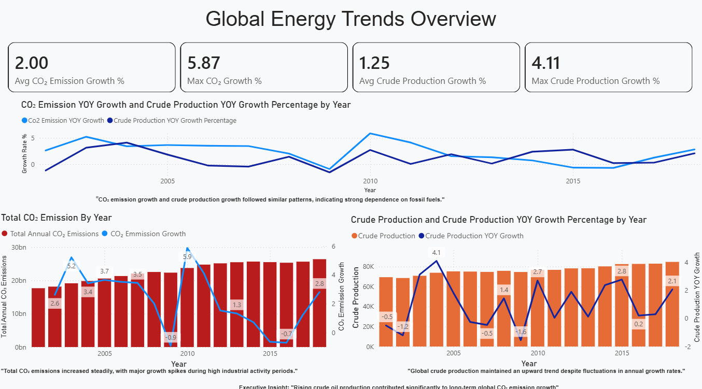
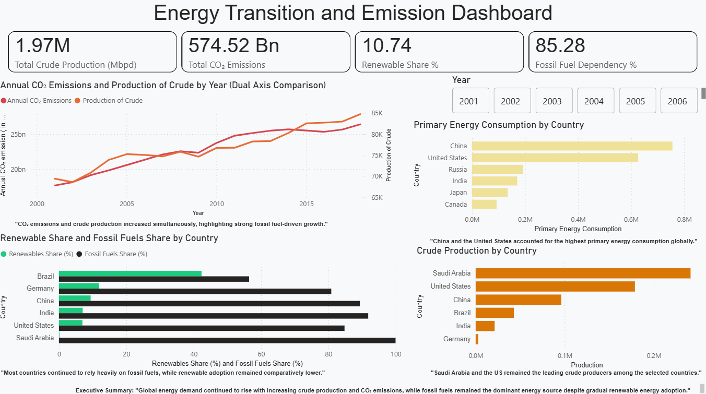
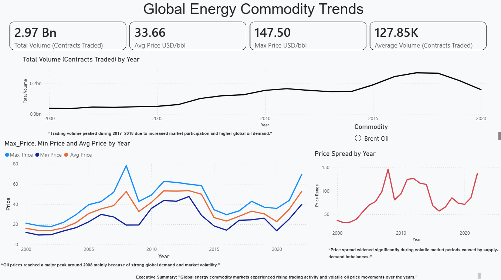
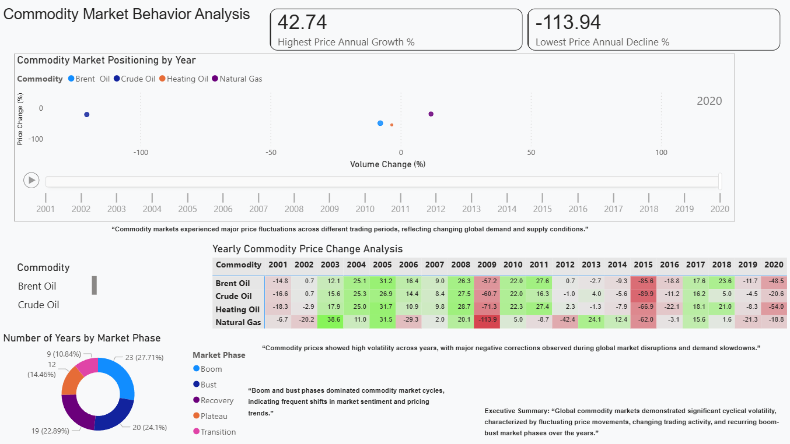

# Global Energy Commodity Intelligence Dashboard

Power BI dashboard project analyzing 20+ years of global energy and commodity market trends (2000–2022).

## Key Focus Areas
- CO₂ emission trends and crude production growth
- Renewable vs fossil fuel dependency
- Commodity price volatility and market cycles
- Energy consumption patterns by country
- Price-volume behavior analysis

## Tools & Technologies
- Power BI
- SQL
- DAX
- Data Modeling
- Time-Series Analysis

## Dashboard Preview

### 1. Global Energy Trends Overview

### 2. Energy Transition & Emission Dashboard

### 3. Global Energy Commodity Trends

### 4. Commodity Market Behavior Analysis

## Key Insights
- Global fossil fuel dependency remained above 85%
- Saudi Arabia remained the leading crude producer
- Natural Gas showed stronger resilience during COVID-19 demand shocks

## Data Sources
- Kaggle — Global Energy & Commodity Market Datasets
- Our World in Data — https://ourworldindata.org/
- Coverage Period: 2000–2022
- Commodity markets exhibited recurring boom-bust cycles
- 2008 recorded the largest oil price spike in the dataset
